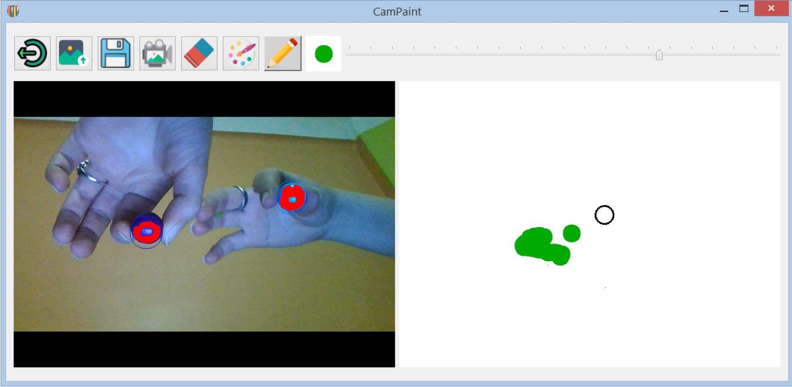

# CamPaint
CamPaint est une application de dessin avec webcam.

## Principe
L'utilisateur utilise deux couleurs distinctes, l’application doit détecter et mémoriser les couleurs choisies.
L'application localise les couleurs sur le flux vidéo et calcule la distance entre eux, le dessin est permis lorsque les deux couleurs sont suffisamment proches.
## Réalisation
Cette application est réalisée en **Python**, seules les fonctions de base de **OpenCv** sont permises ( il s'agit d'une contrainte imposée dans l'énoncé du TP, on utilise openCv juste pour la lecture et l'affichage du flux vidéo). L'interface est réalisée avec **PyQt**.
## Fonctionnalités offertes
- Crayon de dessin, possibilité de changer la taille et la couleur.
- Gomme, possibilité de changer sa taille.
- Charger une image comme arrière-plan de dessin.
- Enregistrer des vidéos et des captures.
